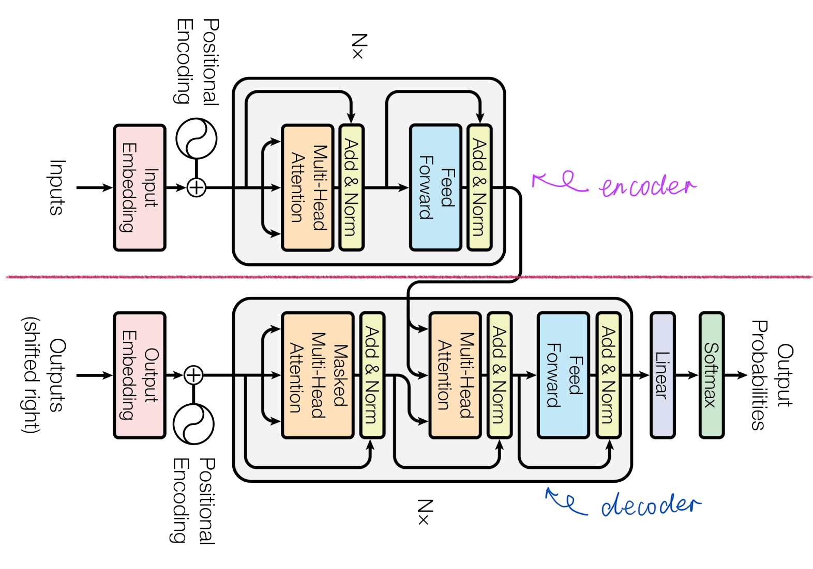
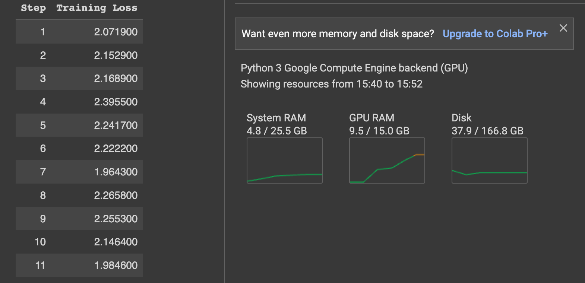
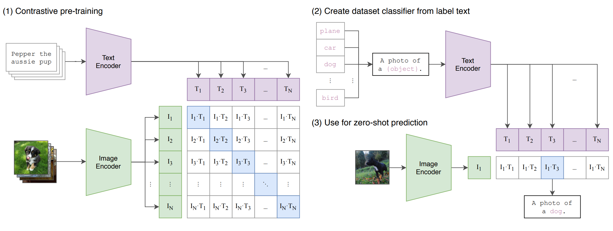
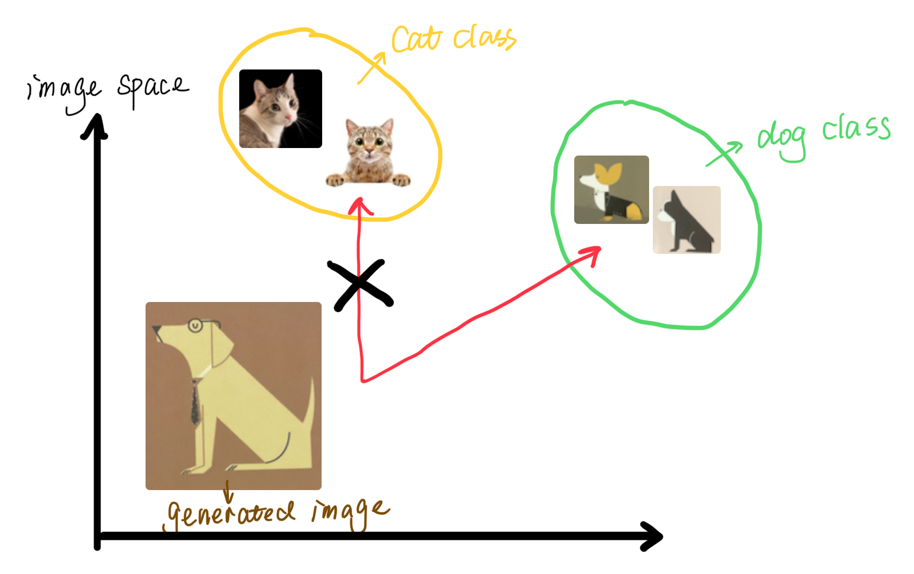
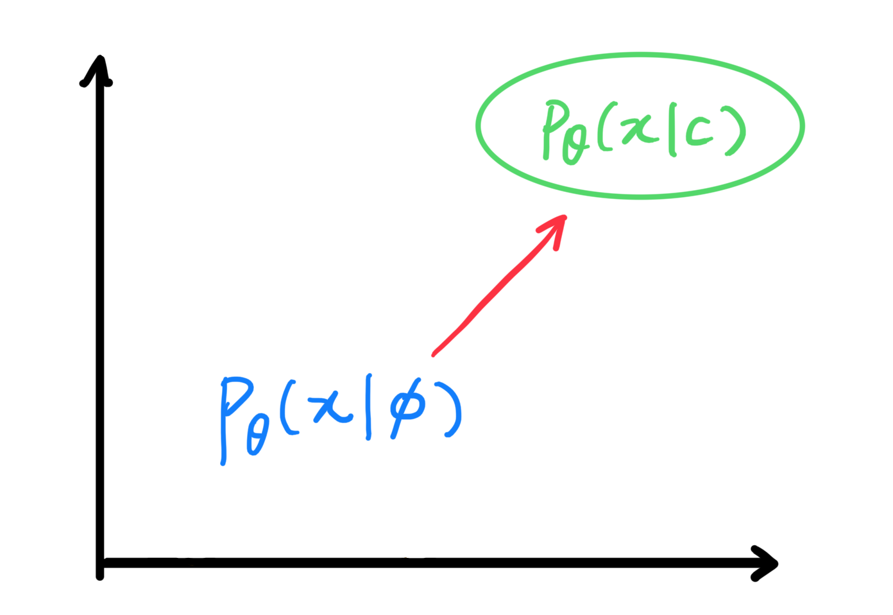
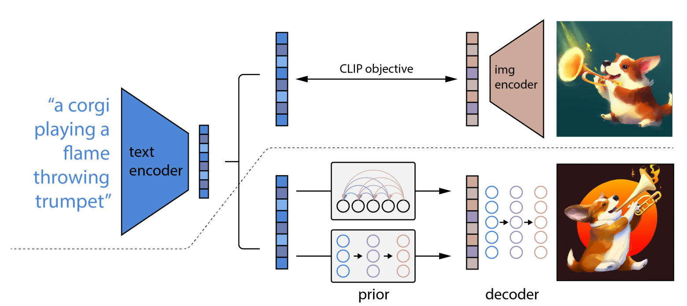
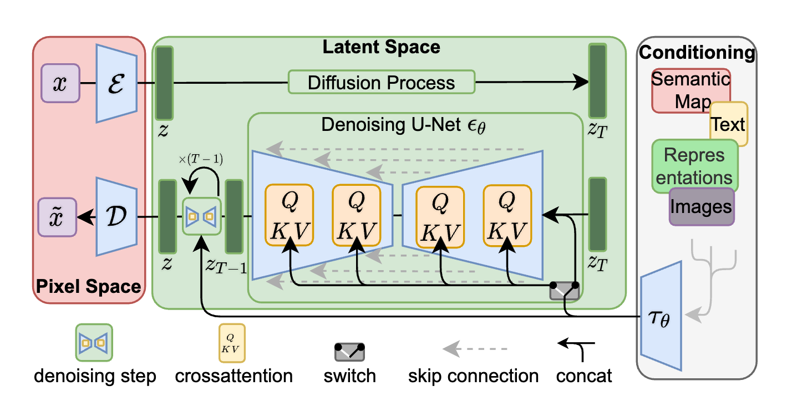

# Everything-about-LLMs

## Lauguage models

### Transformers

The figure below from the original paper[^14] shows the architecture of a transformer. There are so many amazing videos and blogs that explain transfomers very well.  
I wouldn't provide just one more version of it.  You can google around or read the paper yourself. I will actually provide an implementation of it here.

<p align="center">

</p>

Separated by the magenta line in the middle, we will call the structure above this line the *encoder* and below the line the *decoder* for the remainder of the section of Lauguage models.  

### BERT

### GPT

[This folder](./karpathys_gpt) contains Karpathy's implementation of a mini version of GPT. 
You can run it to train a character-level language model on your laptop to generate shakespearean (well kind of :see_no_evil:) text.
He did a very nice tutorial to walk through the code almost line by line. 
You can watch it [here](https://www.youtube.com/watch?v=kCc8FmEb1nY).
If you are completely new to language modelling, [this video](https://www.youtube.com/watch?v=PaCmpygFfXo) may help you to understand more basics.

You can find much more details about the code in [Karpathy's original repo](https://github.com/karpathy/nanoGPT/tree/master#install). 
The code in this folder has been adapted to contain the minimal running code. 

### LLaMA


## Fine-tuning
### LoRA

If you don't know what LoRA is, you can watch this Toutube video [here](https://www.youtube.com/watch?v=dA-NhCtrrVE), or
read the LoRA paper[^1] first. 

- Toy problem: I wrote a notebook to show how to fine-tune a **reeeeaaaal** simple binary classification model with LoRA, see [here](./LoRA.ipynb).

 - The real deal: of course, some amazing people already implemented LoRA as a library.  Here's [the notebook](./LoRA_for_LLMs.ipynb) on how to fine-tune LLaMA 2 with the LoRA library.

### QLoRA

As discussed in the [LoRA for LLMs notebook](./LoRA_for_LLMs.ipynb), we only need to train about 12% of the original parameter count by applying this low rank representation.  However, we still have to load the entire model, as the low rank weight matrix is added to the orginal weights. For the smallest Llama 2 model with 7 billion parameters, it will require 28G memory on the GPU allocated just to store the parameters, making it impossible to train on lower-end GPUs such as T4 or V100.  

Therefore, (**...drum rolls...**) QLoRA[^2] was proposed.  QLoRA loads the 4-bit quantized weights from a pretrained model, and then apply LoRA to fine tune the model.  There are more technical details you may be interested in. If so, you can read the paper or watch this video [here](https://www.youtube.com/watch?v=TPcXVJ1VSRI). 

With the LoRA library (check the notebook), it is very easy to adopt QLoRA.  All you need to do is to specify in the configuration as below: 
```
model = AutoModelForCausalLM.from_pretrained("meta-llama/Llama-2-7b-chat-hf",
                                             device_map='auto',
                                             torch_dtype=torch.float16,
                                             use_auth_token=True,
                                             load_in_4bit=True, # <------ *here*
                                             #  load_in_8bit=True,
                                             )
```
Unfortunately, quantization leads to an information loss.  This is a tradeoff between memory and accuracy.  If needed, there's also an 8-bit option. 

By choosing to load the entire pre-trained model in 4-bit, we can fine-tune a 7-billon-parameter model on a single T4 GPU.  Check out the RAM usage during training: 

<p align="center">

</p>


### RLHF

## Multimodal models

### CLIP

Concenptually, CLIP is very simple. The figure in the CLIP paper[^3] says it all.  



For this visual-language application, step (1) in the figure needs a few components:
- data: images with text describing them
- a visual encoder to extract image features
- a language encoder to extract text features
- learn by maximising the similarity between the paired image and text features indicated by the blue squares in the matrix in the figure (contrastive learning)

I wrote a (very) simple example in [this notebook](./CLIP_for_MNIST.ipynb) which implements and explains the contrastive learning objective, and describes the components in step (2) and (3). However, I used the same style of text labels for training and testing.  So no zero-shot here.  

### GLIDE

GLIDE[^8] is a text-to-image diffusion model with CLIP as the guidance.  If you aren't familiar with diffusion models, you can watch [this video](https://www.youtube.com/watch?v=344w5h24-h8&list=PLpZBeKTZRGPPvAyM9DM-a6W0lugCo8WfC) for a quick explaination to the concept.  If you want more technical details, you can start with these papers: diffusion generative model[^5], DDPM[^6], DDIM[^7], and a variational perspective of diffusion models[^9].  

The classifier-guided diffusion model was intially proposed by Dhariwal & Nichol[^10]. The main idea is this: if the image generated is a dog, we want the parameters of the generative model in training to move towards the direction where it can be classified with the correct label by a *good* classifier, see the illustration below.   

<p align="center">

</p>

It seems to be a great idea.  However, this approach requires training a seperate classifier. Morever, it is not easy to train a good classifier that works perfectly for the generated images. For this reason, Ho and Salimans[^11] proposed a classifier-free guidance, see the figure below. $c$ is the condition (for example, text) on which the images are generated, and $\emptyset$ indicates no condition.  So the model is encouraged to move towards the direction where images are generated with the conditions.  

<p align="center">

</p>

GLIDE uses a CLIP model to replace the classifier in their classifer-guided diffusion model.   

### DALL·E 2

DALL·E 2 is another concenptually simply model that produces amazing results.  

The first half of the model is a pre-trained CLIP (frozen once trained), i.e., the part above the dash line in the figure in the DALL·E 2 paper[^4], see below.  



In CLIP, we have trained two encoders to extract features from image and text inputs.  DALL·E 2 extracts the text embeddings with a pretrained CLIP model, and pass it through a prior model to learn the image embeddings. This prior can be an autoregressive model or a diffusion model.  Finally, a diffusion model is used to produce an image conditioned on the image embeddings learned from the prior as well as the CLIP text embedding optionally.  

DALL·E 2 also enables classifier-free CLIP guidance as used in GLIDE by randomly setting the CLIP embeddings to zero 10% of the time.  

### Stable Diffusion

Stable diffusion is a latent diffusion model[^12] which operates in the latent space instead of the original data space, see the figure below. 

<p align="center">

</p>

The red-shaded and green-shaded parts illustrate the pixel and the latent space. First, stable diffusion uses a pretrained model (VQGAN[^13] in this case) to encode the images to latent, and decode the learned latent back to images. In practice, this reduces a high-resolution image to a latent representation of the shape [64x64xnumber of channels].  

In the latent space, stable diffusion deploys a diffusion model equipped with a denoising U-Net.  In each denoising diffusion step, the U-Net is augmented with the cross-attention machanishm which computes the attention between the noisy latent and whichever conditons included in the model for conditional generation.  

No surprise that classifier-free CLIP guidance is also used in stable diffusion.  The "switch" in the figure above controls whether the model produces images with or without conditions.   

#### Image to Image

An implementation of Stable Diffusion Image-to-Image can be found [here](./stable_diffusion_img2img.py). Alternatively, you can also play with [this notebook](https://colab.research.google.com/drive/15MS1tAK69Nbdv6cnkN0U8GrJAYwtbuw9?usp=sharing).  


## Engineering magics for training an LLM

### Memory Optimization: ZeRO

### Model parallelism: MegatronLM

### Pipeline Parallelism

### Checkpointing and Deterministic Training  

### FlashAttention

### KV caching

### Gradient checkpointing

### Data efficiency

## Reference:

[^1]: Hu, E.J., Shen, Y., Wallis, P., Allen-Zhu, Z., Li, Y., Wang, S., Wang, L. and Chen, W., 2021. [LoRA: Low-Rank Adaptation of Large Language Models](https://arxiv.org/abs/2106.09685), arXiv preprint arXiv:2106.09685

[^2]: Dettmers, T., Pagnoni, A., Holtzman, A. and Zettlemoyer, L., 2023. [QLoRA: Efficient Finetuning of Quantized LLMs](https://arxiv.org/pdf/2305.14314.pdf). arXiv preprint arXiv:2305.14314.

[^3]: Radford, A., Kim, J.W., Hallacy, C., Ramesh, A., Goh, G., Agarwal, S., Sastry, G., Askell, A., Mishkin, P., Clark, J. and Krueger, G., 2021, July. [Learning transferable visual models from natural language supervision](http://proceedings.mlr.press/v139/radford21a). In International conference on machine learning (pp. 8748-8763). PMLR.

[^4]: Ramesh, A., Dhariwal, P., Nichol, A., Chu, C. and Chen, M., 2022. [Hierarchical text-conditional image generation with clip latents](https://cdn.openai.com/papers/dall-e-2.pdf). arXiv preprint arXiv:2204.06125, 1(2), p.3.

[^5]: Sohl-Dickstein, Jascha; Weiss, Eric; Maheswaranathan, Niru; Ganguli, Surya (2015-06-01). [Deep Unsupervised Learning using Nonequilibrium Thermodynamics](http://proceedings.mlr.press/v37/sohl-dickstein15.pdf). Proceedings of the 32nd International Conference on Machine Learning. PMLR. 37: 2256–2265

[^6]:Ho, J., Jain, A. and Abbeel, P., 2020. [Denoising diffusion probabilistic models](https://arxiv.org/pdf/2006.11239.pdf). Advances in neural information processing systems, 33, pp.6840-6851.

[^7]: Song, J., Meng, C. and Ermon, S., 2020. [Denoising diffusion implicit models](https://arxiv.org/pdf/2010.02502.pdf). arXiv preprint arXiv:2010.02502.

[^8]: Nichol, A., Dhariwal, P., Ramesh, A., Shyam, P., Mishkin, P., McGrew, B., Sutskever, I. and Chen, M., 2021. [Glide: Towards photorealistic image generation and editing with text-guided diffusion models](https://arxiv.org/pdf/2112.10741.pdf). arXiv preprint arXiv:2112.10741. 

[^9]: Kingma, D., Salimans, T., Poole, B. and Ho, J., 2021. [Variational diffusion models](https://proceedings.neurips.cc/paper/2021/hash/b578f2a52a0229873fefc2a4b06377fa-Abstract.html). Advances in neural information processing systems, 34, pp.21696-21707.

[^10]: Dhariwal, P. and Nichol, A., 2021. [Diffusion models beat gans on image synthesis](https://arxiv.org/pdf/2105.05233.pdf). Advances in neural information processing systems, 34, pp.8780-8794.

[^11]: Ho, J. and Salimans, T., 2022. [Classifier-free diffusion guidance](https://arxiv.org/abs/2207.12598). arXiv preprint arXiv:2207.12598.

[^12]: Rombach, R., Blattmann, A., Lorenz, D., Esser, P. and Ommer, B., 2022. [High-resolution image synthesis with latent diffusion models](https://openaccess.thecvf.com/content/CVPR2022/papers/Rombach_High-Resolution_Image_Synthesis_With_Latent_Diffusion_Models_CVPR_2022_paper.pdf). In Proceedings of the IEEE/CVF conference on computer vision and pattern recognition (pp. 10684-10695).

[^13]: Esser, P., Rombach, R. and Ommer, B., 2021. [Taming transformers for high-resolution image synthesis](https://openaccess.thecvf.com/content/CVPR2021/papers/Esser_Taming_Transformers_for_High-Resolution_Image_Synthesis_CVPR_2021_paper.pdf). In Proceedings of the IEEE/CVF conference on computer vision and pattern recognition (pp. 12873-12883).

[^14]: Vaswani, A., Shazeer, N., Parmar, N., Uszkoreit, J., Jones, L., Gomez, A.N., Kaiser, Ł. and Polosukhin, I., 2017. [Attention is all you need](https://proceedings.neurips.cc/paper_files/paper/2017/file/3f5ee243547dee91fbd053c1c4a845aa-Paper.pdf). Advances in neural information processing systems, 30.

